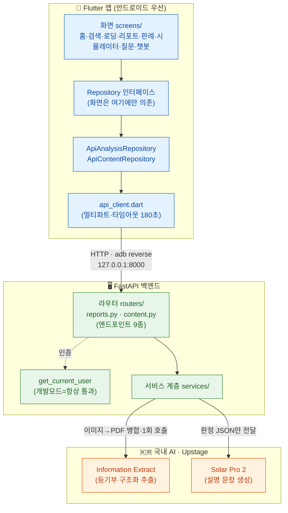
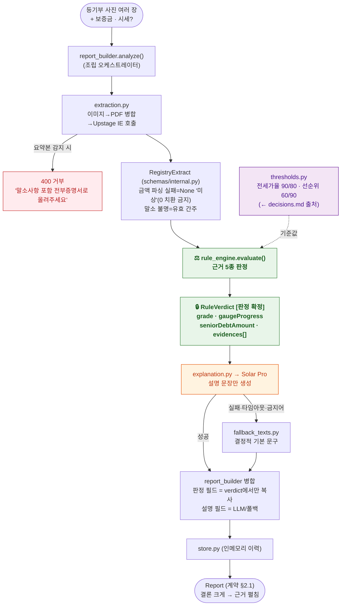
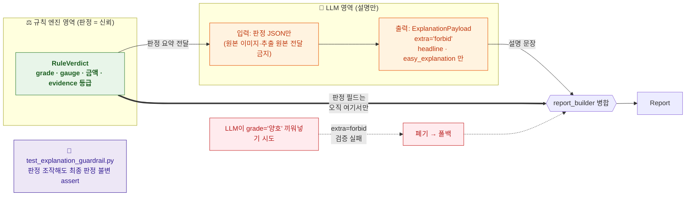
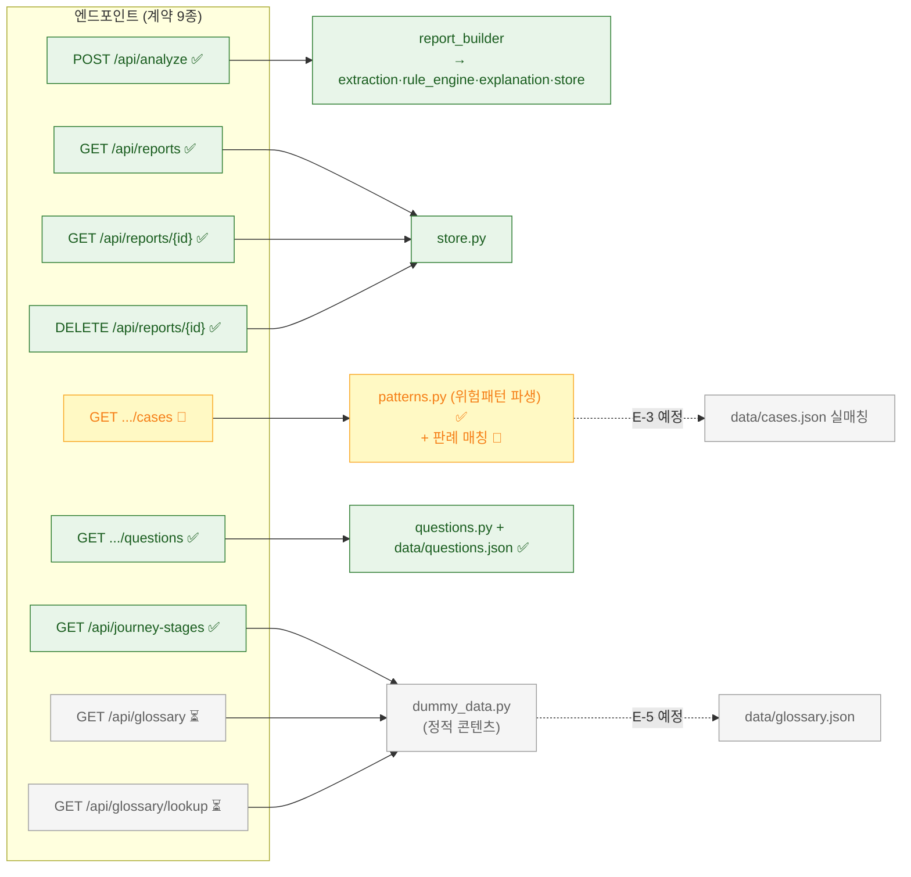
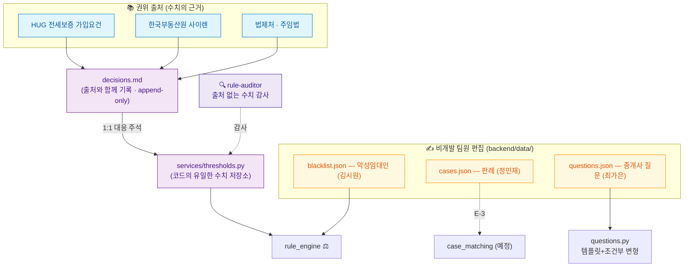
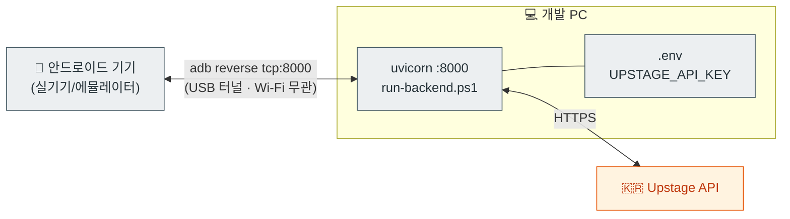

# 시스템 아키텍처 (architecture.md)

> 전세AI프의 최종 산출물 기획을 기반으로 한 아키텍처 플로우차트입니다.
> Phase E(더미→실기능 교체) 기준으로, **핵심 불변 원칙인 "규칙 엔진이 판정 → LLM은 설명만"
> 가드레일**이 구조에 어떻게 박혀 있는지를 중심으로 그렸습니다.
>
> 상태 표기: ✅ 구현 완료 · 🔄 진행 중 · ⏳ 예정(Phase 표기)
>
> GitHub·VS Code(Mermaid 확장)·Obsidian 등에서 다이어그램이 렌더링됩니다.

---

## 1. 전체 시스템 아키텍처

앱은 계약(api-contract.md)만 알고 서버 내부는 모릅니다. 서버는 라우터 → 서비스 계층으로
분리되고, 국내 AI(Upstage)만 외부 호출합니다.

---

## 2. 분석 파이프라인 (핵심) — `POST /api/analyze`

등기부 사진 한 장이 안전도 리포트가 되기까지. **판정은 규칙 엔진이 확정하고, LLM은 그
판정을 받아 문장만 만든다**는 흐름이 한 방향으로 고정돼 있습니다.

---

## 3. 가드레일 — LLM이 판정을 바꿀 수 없는 이유

"LLM은 통역사"라는 원칙이 **코드 구조로 강제**됩니다. 판정 필드가 LLM 출력 모델에
아예 존재하지 않아서, 환각이 섞여도 판정에 닿을 통로가 없습니다.

**설명 실패해도 리포트는 항상 완성됩니다** — Solar Pro 호출이 실패/타임아웃/금지어에 걸리면
해당 부분만 `fallback_texts`의 결정적 문구로 치환하고, 판정은 그대로 나갑니다. 분석 실패로
격상되지 않습니다.

---

## 4. 엔드포인트 ↔ 서비스 매핑 (구현 상태)

- 🔄 **판례(cases)**: 위험 패턴 파생은 실동작(`patterns.py`)하지만 매칭은 아직 더미 — **E-3**에서
  `data/cases.json` 큐레이션 매칭으로 교체.
- ⏳ **용어(glossary)**: 아직 `dummy_data` — **E-5**(여유 시)에서 `data/glossary.json`으로 분리.
- **여정(journey-stages)**: 정적 콘텐츠라 교체 대상 아님(계약상 모든 사용자 동일).

---

## 5. 데이터 소스 & 팀 편집 영역

수치는 **권위 출처 → decisions.md → 코드** 순서로만 흐르고, 큐레이션 콘텐츠는 비개발
팀원이 코드 없이 채웁니다.

---

## 6. 배포·연결 (개발/시연 환경)

---

## 핵심 불변 원칙 (아키텍처에 박힌 것)

1. **판정 = 규칙 엔진, 설명 = LLM** — LLM 출력 모델에 판정 필드가 없어 구조적으로 차단 (§2·§3)
2. **출처 없는 수치 금지** — 모든 임계값은 `decisions.md → thresholds.py`만 경유 (§5)
3. **보수적 편향** — 금액 파싱 실패=미상(0 치환 금지), 말소 불명=유효 간주, 페이지 누락 시 양호 금지 (§2)
4. **앱↔계약 무변경** — 실기능 교체는 서버 내부(services/)에서만 (§1·§4)
5. **국내 AI만** — Upstage Information Extract + Solar Pro (§1)
